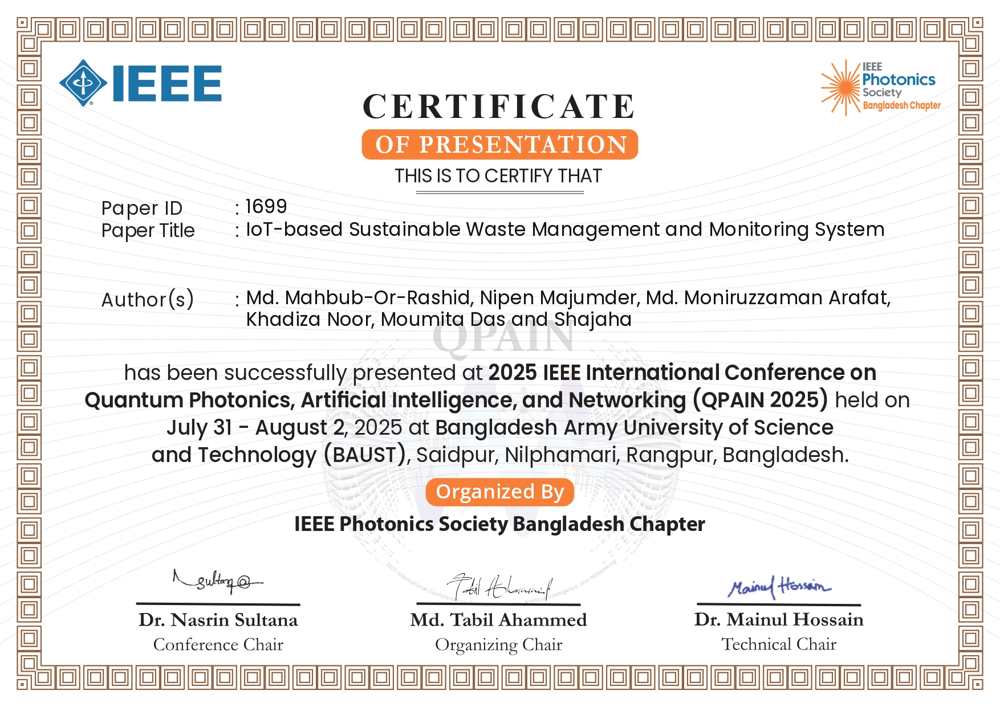

<h1 align="center">Hi 👋, I'm Md Moniruzzaman Arafat</h1>
<h3 align="center">MERN Stack Developer | JavaScript Enthusiast | Problem Solver</h3>

<p align="center">
  
</p>

---

## 🧑‍💻 About Me

- 💡 A self-motivated **MERN Stack Developer** passionate about building full-stack applications
- 💬 I write clean, scalable, and testable code using the latest JavaScript practices
- 🌱 Currently learning **Next.js**, **Docker**, and **GraphQL**
- 📫 Reach me at: **[mdmoniruzzamanarafat@gmail.com](mailto:mdmoniruzzamanarafat@gmail.com)**
- 👨‍🎓 Life goal: **Be a consistent learner and excellent problem solver**

---

## 🛠️ Tech Toolbox

```bash
Languages:   JavaScript • TypeScript (basic) • HTML • CSS
Frontend:    React.js • Redux • Context API • TailwindCSS • Bootstrap
Backend:     Node.js • Express.js • REST API • JWT • Socket.io
Database:    MongoDB • Mongoose • Firebase (basic)
Tools:       Git • GitHub • VS Code • Postman • Netlify • Vercel
Others:      Linux (Ubuntu) • Docker (basic) • Figma
```
<!--
 🚀 Projects

Here are some of the projects I've worked on:

### 🔹 [MyHotel](https://github.com/yourusername/myhotel)
A hotel management system built with MERN Stack. Includes room booking, admin dashboard, and user authentication.

- 🧱 Stack: React, Node.js, Express, MongoDB, JWT
- 🔐 Features: Admin panel, CRUD, login system
- 🌐 Demo: [myhotel.live](https://myhotel.live)

---

### 🔹 [ChatRoom](https://github.com/yourusername/chatroom)
A real-time group chat application using Socket.io.

- 📦 Stack: Node.js, Express, Socket.io, HTML/CSS
- 💬 Features: Join rooms, public chat, live user count
- 🌐 Demo: [chatroom.live](https://chatroom.live)

---

### 🔹 [Task Manager](https://github.com/yourusername/task-manager)
A simple task manager where users can add, update, and delete tasks.

- ⚛️ Stack: React, LocalStorage
- ✅ Features: Mark completed, filter tasks

---

### 🔹 [Weather App](https://github.com/yourusername/weather-app)
Check current weather based on location using OpenWeatherMap API.

- 🔍 Stack: HTML, CSS, JavaScript
- 🌤️ Features: Search by city, live temperature and humidity

-->


### 🎓 Education

- 📍 **Bangladesh University of Business and Technology-BUBT (B.Sc. in Computer Science & Engineering (CSE))**  
   — 2021(april) – 2025(may)  
  CGPA: 3.24/4.00

- 📍 **Feni Polytechnic Institute-FPI (Diploma in Computer Science and Technology)**  
   — 2016(jun) – 2020(December)  
  GPA: 3.12/4.00

  ## 🎓 My Certificate

<p align="center">
  
</p>


<h3 align="center">Statistics</h3>
<div align="center">
<a href="https://github.com/MD-Moniruzzaman-Arafat">


</div>
<h2 align="left">⚡Activity Graph:</h2>

